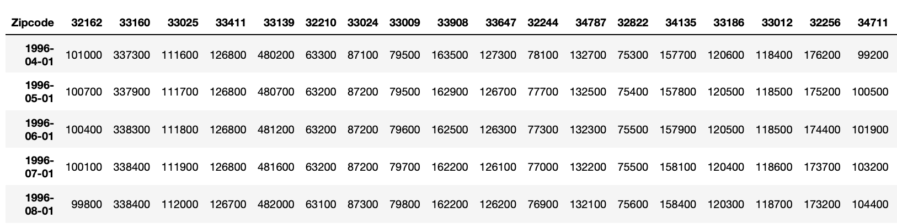

# Top 5 Zip Codes in Florida to Invest In
**Author:** Aziza Gulyamova
***

## Overview

For this project, I will be acting as a consultant for a real-estate investment firm. The main goal for my project is to identify **Top 5 zipcodes** that are worth investing in and **forecast the price** for future. The assumptions that real investment firm has to meet are following: 

* The minimum capital of investment is \$200,000
* The goal is to invest in highly urbanized U.S. areas
* Low risk factor (low volatility threshold)
 
***

### Why Florida State?

insert article
***

## Data

The **Home Listing and Sales** dataset was provided by **Zillow Research**. The data represents **median monthly housing sales prices** over the period of April 1996 through April 2018.
 
Each row represents a unique zip code. Each record contains location info and median housing sales prices for each month.
 
The raw CSV contained the following **columns:**

RegionID  
RegionName -- ZIP Code  
City  
State  
Metro   
CountyName  
SizeRank -- rank of the zipcode according to urbanization.

**Link to dataset:** https://www.zillow.com/research/data/

***

## Analysis Outline

<b>Data Exploration</b>

    <ul>
        <li>Import Packages</li>
        <li>Upload Dataset</li>
        <li>Explore Dataset</li>
        <li>Visual Exploration</li>
    </ul>

     

<b>Exploration Analysis</b>

    <ul>
        <li>Minimum Price</li>
        <li>Volatility</li>
        <li>ROI for 24 Months</li>
    </ul>

     

<b>Data Preparation</b>

    <ul>
        <li>Sationarity</li>
        <li>Non Stationary to Stationary</li>
        <li>ACF and PACF</li>
    </ul>

     
  

<b>BASELINE ARIMA MODEL</b>

    <ul>
        <li><b>Train Test Split</b></li>
        <li>Model Evaluation</li>
        <li>Grid Search for Best C - Value</li>
        <li>Model Summary</li>
    </ul>

     

<b>K Nearest Neighbors Classifier</b>

    <ul>
        <li><b>Model 2: KNN with All Features</b></li>
        <li>Model Evaluation</li>
        <li>Model Summary</li>
    </ul>

  

<b>Decision Tree Classifier</b>

    <ul>
        <li>Model Evaluation</li>
        <li>Model Summary</li>
    </ul>

 

<b>Modeling Conclusion</b> 
<b>Evaluation of Final Model</b> 
<b>Recommendations Based on Final Model</b> 
<b>Next Step</b>

## Data Cleaning and Explorations

The dataset is stored in **wide format**, meaning all observations of **time feature** are stored as **individual columns** with median **house price of each zipcode as observations**:

Since my focus for the project is **zipcodes of Florida State**, I've filtered out needless zipcode observations and selected zipcodes that are in **top 15 quantile by SizeRank** variable. At the end, the dataset contained **only 118 zipcodes out of 14,723.** 

Before proceeding with explorations, I've converted **time feature** variables **into datetime** datatype, **transposed the dataset** and **removed unnecessary features**, such that "RegionID", "City", "State", "Metro", "CountyName".

At the end of the cleaning process, the dataset looked as following:

To check visually if data has **trends and seasonality**, I plotted **graph of median prices for each zipcode**.

- It is clear that **most of the zipcodes has low volatility**, but there are some that have **noticable trendiness**. The downfall in period **from 2007 - 2012** had occured due to **economic crash in Great Recession period**. According to IG.Ellen, one of the truly distinctive features of Great Recession is the **severe housing crisis** layered on top of all the labor market problems (G.Ellen, 2012).
After 2012 the market started to recover.

***

### Medium Price as Investment Capital

As per my project assumptions, I calculated the **minimum amount of capital** that investors suppose to own. In order to determine that minimum amount, I calculated the **average house prices for 2018** (4 months) and use the **median price as a required capital.** Following **boxplot** represents those average prices:

**Some zipcodes' the median price** for the house is **extremly high**, thus I **dropped those zipcodes** from the dataset, since they represent **outliers**.

The **median house price** for 4 months appears to be **$250,000.** To lower the threshold of entering the market, I used **$200,000 as a minimum capital to invest**. As a result, I **dropped** all zipcodes that have **median price lower than $200,000**.

***

### Volatility of the Market

To filter out the **zipcodes with average risk for investment**, I **calculated the volatility of prices at each zipcode**. Goal was to extract zipcodes that have averagre volatility, considering **low volatility** means **less returns** and **high volatility** might be **too risky.**

Since **before 2012 the market had a housing bubble** and that fluctuation might have affected the volatility results, I used observations **only after 2012 to investigate the volatility.**

To calculate **Historical Volatility**, I **used standart deviation of log returns**. First, I **calculated historical ROI for each zipcode.** After annual volatility rate was obtained, I build a following boxplot:

The graph shows that the **median value for volatility rate was around 1.7**. I **kept zipcodes with volatility rate betwwen 1.7-2.9.** based on project assumptions.

***

### Calculate the ROI for the last 24 months

Considering that I want the zipcodes with **high performance on returns**, I calculated the **average 24 months ROI percentage** of each zipcode, in order to find **zipcodes that have highest return.**

The **median ROI** for the last 24 months of all zipcodes in Florida was **7%**, but I focused on those zipcodes, that had **return rate higher than upper quantile,** which was **9.5%**.

***

#### Data Cleaning and Exploration Summary:

The datast had been cleaned out and filtered down as follows:
* Zipcodes of **Florida State** had been selected
* Zipcodes with **urbanization rank** in **top 15 quantile**
* The **minimum median price of housing was \\$200,000** for the last 4 months
* The **volatility range** of the median price is **1.7 - 2.9**
* The **ROI rate is greater than 9.5%**

The initial **amount of zipcodes** was reduced **from 14723 to 14.**

***

## Data Preparation

Before proceeding to modeling I checked the **data stationarity and autocorrelation of the prices by using visual tools and Dicky-Fuller Test funtion.** 

The **Dickey- Fuller Test** showed that none of the **zipcodes'** data **met stationarity assumption**, meaning the **test statistics** were **higher than critical value 10%** and **p-value greater than 0.05**. I tried following transformation methods to **modify data before modeling:**

* Differencing data on multiple levels
* Log transformation
* Differencing log transformed data on multiple levels
* Second order differencing
* Second order differencing on log transformed data

The **second order differencing** came to be the best choice to **transform data to stationary**. All zipcodes have **met the critical value assumption, but only 8** out of 14 zipcodes have **met the p-value parameter**. For further analysis I **kept working with 8 zipcodes** that have met critical value assumption and p-value parameter. The following graph is **breakout graph for each zipcode**:

The **dataset** itself looked as follows:

***

### ACF and PACF

The ACF graphs showed that the **median prices** of houses are **significantly correlated for first lag** for most of the zipcodes and all zipcodes have **negative correlation at different lags.**

***

# Baseline Auto - ARIMA Model

To proceed with modeling, I created **8 separate datasets** with **time as index and median price as values.**

The **holdout set was 20%** of the data and **training set 80%**. the **test set consisted of 20%** of 80% that was left for trainig.

I've built **8 different auto-ARIMA models** and evaluated results based on **AIC and RMSE parameters**:

* **Model 1** (33064) showed the best results in terms of **AIC value (2611)** and **Model 7** (33033) showed best results for **Testing RMSE (379.3)**. Following graph contains  **plot of predictions** and **diagnostics plot** for those two models.

### Summary:

* Standardized residual graphs show that the **residual errors fluctuate around 150** for both of the models. 
* Histogram of the **Model 1** shows **normally distributed residuals**, since KDE and N are close to each other. 
* The **Normal Q-Q** graph shows **better performance of Model 1.**
* **Correlogram** shows **non significant correlation** for both models. 

***

# SARIMAX Model with (2, 0, 0) order

Since **Model 1** performed better than other models in auto - ARIMA, I've built SARIMAX model with order of (2,0,0) - setting the regression value to two lags, and ran all datadframes through that model to evaluate performance.

The **results** are following:

### Summary:

The **AIC parameter is higher** than in AUTO-ARIMA model, the **training set is overfitting model.**

***

# Facebook Prophet Model

I built a Facebook Prophet Model since it suppose to **perform better with seasonal data, be robust to shifts in trend and hande outliers well.** The data for FB Prophet should **be non differenced**, thus I created **new train and test splits for modeling**, where **time feature was named "ds" and price values - "y".**

After building models for three datasets, it was clear that **Facebook Prophet performed worse than ARIMA models**. The **Mean Squared Error was higher with Prophet** and due to noticable fluctuation in dataset, the model **forecasted in downward direction**, whereas the **actual values go up**.

***

# Final SARIMAX  Model

The evaluation of all models showed that **SARIMAX model built by auto-ARIMA** for zipcode "33064" **performed better** than others. Thus, I used that as **final model to forecast on test and holdout data**. 

Based on model metrics, the following zipcodes are the best options: **33064, 32825, 32771, 33033, 34698**.

***

## Results:

* All **training data overfitted models**.
* The **models are all very skewed** because of the market crash in 2009.
* Relying on the project assumptions, data exploration and modeling, following zipcodes are chosen as best ones to invest in:**33064, 32825, 32771, 33033, 34698**

## Notes:

* Real estate **predictions** may vary due to **unseen fluctuations** in the market.

## Next Steps:

* Obtain **data after 2018 for current predictions.
* Use **samples only after Great Recession** period to model.
* Set **ROI threshold to lower values.**

